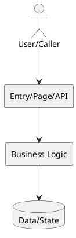
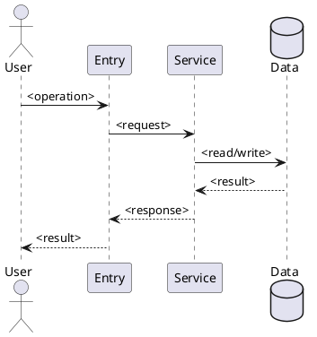
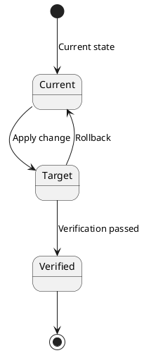

# <Requirement Name> Technical Plan

based_on_spec_hash: `<spec-hash>`

## 1. Background

Describe how this plan bridges the spec into system design facts: modules, interfaces, pages, data, permissions, runtime paths, verification, and rollback strategy.

## 2. Goals and Non-Goals

### 2.1 Goals

- <Goal 1>

### 2.2 Non-Goals

- <Explicitly out-of-scope work>

## 3. Current State

Describe the real current code and data paths. Prioritize critical files, entry points, interfaces, tables, permissions, configuration, external dependencies, and known issues.

### 3.1 <Current State Group>

- `<path/or/symbol>`: <Current behavior>

## 4. Target Design

### 4.1 Component Impact

When the change crosses more than two modules, pages, controllers, services, tables, external systems, or runtime stages, provide a component diagram. For a narrow single-point change, write `N/A because ...`.

### 4.2 Existing System Path

Describe the existing code, data, page, permission, command, or runtime path that should be modified. If a new path is required, explain why the current path cannot safely carry the change.

### 4.3 Boundary Map

| Boundary | Owner / Current Path | Target Rule | Must Not Cross |
|---|---|---|---|
| <system/data/interface boundary> | <owner/path> | <target behavior> | <out-of-scope or forbidden change> |

### 4.4 <Key Target Design Point>

Describe target entry points, permissions, data flow, validation, boundaries, and invariants.

## 5. Interaction and Flow Design

When there are multi-step calls, page interactions, service collaboration, async flows, permission chains, or side effects, provide a flow or sequence diagram.

## 6. Data, State, and Consistency Design

Describe the fields, states, migrations, relationships, invariants, and consistency requirements involved in this change. State which null/fallback cases are real external boundaries, legal business states, historical dirty data, or invariant violations that should not be hidden.
When there is migration, permission switching, release/rollback transition, lifecycle change, or a state machine, provide a state diagram.

## 7. API / Page / Interface Contract Design

When this touches an API, page, permission, configuration, CLI, file format, or external contract, use a current/target comparison table.

| Capability | Current | Target |
|---|---|---|
| <Capability> | <Current behavior> | <Target behavior> |

## 8. Concurrency, Transactions, and Consistency Design

Describe concurrency, transactions, idempotency, repeat execution, failure recovery, and partial-success semantics. If not relevant, write `N/A because ...`.

| Risk | Control | Verification |
|---|---|---|
| <Consistency risk> | <Control> | <Verification method> |

## 9. Risk Controls

| Risk | Control | Verification |
|---|---|---|
| <Risk> | <Control> | <Verification evidence> |

## 10. Release and Rollback

Describe release order and rollback order for code, configuration, data, permissions, or migrations. If shared environments or data changes are not involved, write `N/A because ...`.

### 10.1 Release Order

1. <Step>

### 10.2 Rollback Order

1. <Step>

## 11. Validation Matrix

| Area | Scenario | Verification Method | Evidence |
|---|---|---|---|
| Changed Path | <Direct behavior changed by this plan> | <Verification method> | <Evidence type> |
| Upstream Entry | <Page/API/command/scheduled entry> | <Verification method> | <Evidence type> |
| Downstream Consumer | <Queue/file/email/external/shared consumer> | <Verification method or N/A> | <Evidence type> |
| Shared Component Regression | <Shared mapper/service/template/permission/config> | <Verification method or N/A> | <Evidence type> |
| State & Failure | <Idempotency/retry/rollback/partial failure> | <Verification method or N/A> | <Evidence type> |
| Delivery | <SQL/config/permission/menu/rollback> | <Verification method or N/A> | <Evidence type> |

Recommended minimum automated verification:

- <Command or N/A>

Recommended minimum manual verification:

- <Page, API, data, or flow check>

## 12. Key Decisions

- <Decision already made that affects design, verification, or rollback>

## 13. Alternatives and Tradeoffs

### 13.1 <Alternative>

Rejected because: <Reason>

## 14. Plan Gaps and Blockers

### 14.1 Resolved Open Questions

- <OQ or None>

### 14.2 Blockers

- None / <Issue that blocks later stages>

### 14.3 Notes

- <Non-blocking note that affects design understanding, verification, or delivery judgment>

Do not write task slicing rationale, builder instructions, task execution strategy, execution order, or do-stage boundaries in this plan.
