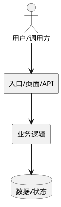
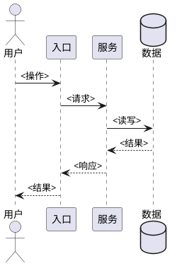
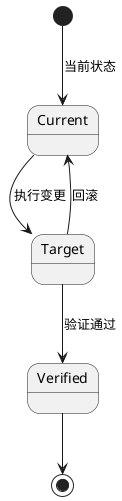

# <需求名>技术方案

based_on_spec_hash: `<spec-hash>`

## 1. 背景

说明本方案从规格到系统设计事实的桥接范围：覆盖哪些模块、接口、页面、数据、权限、运行路径、验证和回滚策略。

## 2. 目标与非目标

### 2.1 目标

- <目标 1>

### 2.2 非目标

- <明确不做的范围>

## 3. 当前状态

按当前真实代码和数据路径说明现状。优先列出关键文件、入口、接口、表、权限、配置、外部依赖和已知问题。

### 3.1 <当前状态分组>

- `<path/or/symbol>`: <当前行为>

## 4. 目标设计

### 4.1 总体组件影响

当改动跨越两个以上模块、页面、Controller、Service、表、外部系统或运行阶段时，必须提供总体组件图。小范围单点改动可写 `N/A，原因：...`。

### 4.2 <关键目标设计点>

说明目标入口、目标权限、目标数据流、目标校验、目标边界和不变项。

## 5. 交互与流程设计

当存在多步调用、页面交互、服务协作、异步流程、权限判断链路或副作用时，必须提供流程图或时序图。

## 6. 数据、状态与一致性设计

说明本次涉及的数据字段、状态、迁移、关联关系、不变式和一致性要求。

当涉及迁移、权限切换、发布回滚、生命周期变化或状态机时，必须提供状态图。

## 7. API / 页面 / 接口契约设计

当涉及接口、页面、权限、配置、CLI、文件格式或外部契约时，使用当前/目标对照表。

| 能力 | 当前 | 目标 |
|---|---|---|
| <能力> | <当前行为> | <目标行为> |

## 8. 并发、事务与一致性设计

说明并发、事务、幂等、重复执行、失败恢复和部分成功语义。若不涉及，写 `N/A，原因：...`。

| 风险 | 控制措施 | 验证 |
|---|---|---|
| <一致性风险> | <控制> | <验证方式> |

## 9. 风险控制

| 风险 | 控制措施 | 验证 |
|---|---|---|
| <风险> | <控制措施> | <验证证据> |

## 10. 发布与回滚

说明代码、配置、数据、权限或迁移的发布顺序和回滚顺序。若不涉及共享环境或数据变更，写 `N/A，原因：...`。

### 10.1 发布顺序

1. <步骤>

### 10.2 回滚顺序

1. <步骤>

## 11. 验证矩阵

| 验收 | 验证方式 | 证据 |
|---|---|---|
| AC-1 | <验证方式> | <证据类型> |

建议最小自动验证：

- <命令或 N/A>

建议最小手工验证：

- <页面、接口、数据或流程检查>

## 12. 关键决策

- <已经确定且会影响设计、验证或回滚的决策>

## 13. 替代方案与取舍

### 13.1 <替代方案>

放弃原因：<原因>

## 14. 计划缺口与阻塞项

### 14.1 已解决的开放问题

- <OQ 或 None>

### 14.2 阻塞项

- None / <阻止继续后续阶段的问题>

### 14.3 注意事项

- <不阻塞但影响后续设计理解、验证或交付判断的事项>

注意：这里不写任务拆分依据，不写 builder 指令，也不得描述任务拆分策略、执行顺序或 do-stage 边界。
